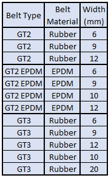
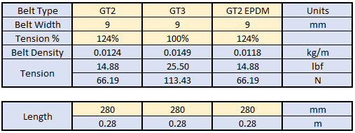

# Belt Tension Calculator
This is a calculator built in Excel that can be used to output pluck frequencies at the recommended belt tensions per GATES specifications for their 2MGT belts. This sheet is compatible with 2MGT GT2 with widths of 6-12mm, EPDM 2MGT GT2 with widths of 6-12mm, and 2MGT GT3 belts with widths from 6-20mm as listed here:

## Instructions

### Blue "Fixed/Calculations" Cells
These cells take up the majority of the sheet and should not need to be modified.  They are used for fixed values or for calculations.

### Yellow "Input" Cells

Input the belt type, width, and tension percentage.  Belt type and width are specific to the belt being using for assembly.  Tension percentage can be adjusted to meet provided recommended values.  Start at 100% tension, but this can be adjusted to prevent overtensioning breaking idler bearings or adjusted to intentionally overtension to recommended values.

Input the length of the belt span.  This should be the distance between the center of the pulleys the belt is riding on.  For example, the [Annex Engineering K3](https://github.com/Annex-Engineering/Gasherbrum-K3) XY belts have a span length of 280mm.

### Green "Output/Variable" Cells

These are the belt frequency outputs.  Compare these to values measured when you pluck the belts along the input belt span using a sound Spectrum Analyzer phone application or similar.  The [GATES Carbon Drive](https://play.google.com/store/apps/details?id=com.gates.carbondrivecalculator&hl=en_US&gl=US) and [Panotuner](https://play.google.com/store/apps/details?id=com.soundlim.panotuner&hl=en_US&gl=US) apps have worked well, but there are lots of other options.  Then just adjust the belt tension until the measured frequencies match the outputs.